<div align="center">
  <h1>Python Task Workbench</h1>
  <p>
    
    
    
  </p>
</div>

> Hands-on Python exercises on **collections** and related patterns: synthetic tasks, pluggable packs, and checking your solution from one module—via a **PyQt6** desktop app or a **JSON-driven CLI** (`solve` / `check` / `coach`).

The same codebase hosts a **trainer UI** (session flow, editor, history) and a **batch generator** (terminal output, exports, coach hints). Configuration lives in a **single** `config/config.json` shared by both paths.

---

## Contents

**Introduction**

- [Features](#features)
- [UI overview](#ui-overview)
- [How it fits together](#how-it-fits-together)
- [Architecture (Mermaid)](#architecture-mermaid)

**Run and configure**

- [System requirements](#system-requirements)
- [Stack](#stack)
- [Repository layout](#repository-layout)
- [Configuration](#configuration)
- [Running the application](#running-the-application)
- [CLI modes](#cli-modes)
- [GUI workflow](#gui-workflow)

**Content and data**

- [Content packs](#content-packs)
- [Data and artifacts](#data-and-artifacts)
- [Solution file (CLI)](#solution-file-cli)

**Development**

- [Quick start](#quick-start)
- [Tests and quality tools](#tests-and-quality-tools)
- [License](#license)

---

## Features

### Generation and sessions

- **Content packs** — Tasks come from discovered packs under `content_modules/`; variants are chosen with **history-aware** anti-repeat logic within a batch and across runs.
- **Domains and profiles** — Flavours such as ecommerce, analytics, devops, education, plus presets for **volume**, **ordering**, and clean vs “dirty” data.
- **Input shapes** — Pack-defined recipes: `list[dict]`, dict-index, columns, rows+fields, bundles, tuple- and set-like layouts, mixed collections, paired lists, grouped chunks, and more.
- **Story and inverse** — Optional linked **story** sessions and **inverse** tasks with a configurable rate.

### Checking

- **GUI** — `core.checker` runs code in a **subprocess**, respects `ui_check_timeout_sec`, resolves the learner entry via `checker_entry_mode` (`strict` / `hybrid`), and compares results with optional **strict typing**.
- **CLI** — Same contract: `ast` parse, `exec`, `TASK_IDS`, mutation checks, `ANSWERS` vs expected outputs.
- **Coach (CLI)** — Adds approach hints (e.g. `collections` / `itertools` / `functools`) and optional **input → expected** preview when enabled in config.

### Desktop application

- **Layout** — Left: task statement, **input** / **expected** previews, **constraints**. Center: `CodeEditor` with line numbers. Right: **History** and **Settings** tabs. Header: session **Start** / **Check** / **Stop** and a **timer**.
- **Lifecycle** — Session start → `TaskSession` → per-task checks → **session summary** → optional rows in **SQLite** history.
- **History** — Searchable table, per-row report/code/export, export-all, clear; **details** dialog for a full single run (input, expected, actual, error, code).

### CLI and exports

- **Exports** — Markdown or pytest from the CLI; history rows can be exported to standalone **Python** files from the GUI.
- **Extensibility** — Each pack ships `module.json` and optionally `module.py`, `generator.py`, or declarative JSON consumed by `task_packs`.

---

## UI overview

### New session

*Choose packs, batch size, and optional seed before practice starts.*

- Scrollable **multi-select** of packs (`task_packs.list_available_pack_labels`).
- **Count** (bounded spin) and **seed** (optional text); **Start** is enabled only when at least one pack is selected.
- On accept, the dialog builds a full **`SessionConfig`** (including `checker_entry_mode`, `strict_types`, timeouts) for `build_session`.

<p align="center">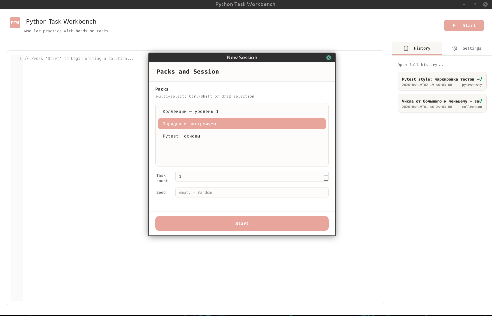</p>

### Main window

*Three columns and a header while a session is active.*

- **Header** — Title; **Start** when idle, or **Check**, **Stop**, and **timer** when a session runs.
- **Body** — Splitters from `ui_splitter_sizes`: task aside | editor | right tab strip (**History** cards / **Settings**).

<p align="center">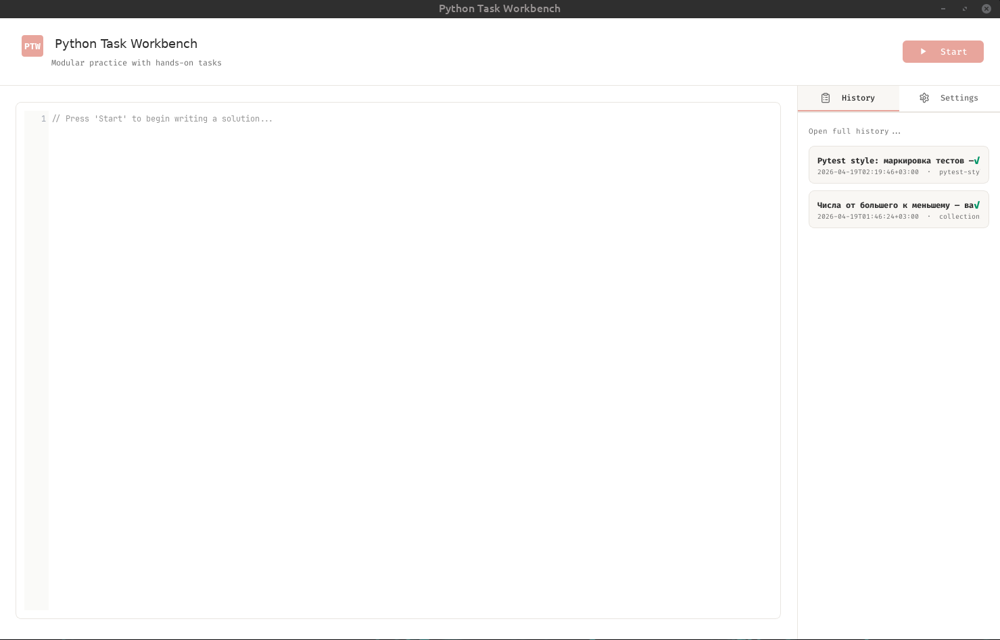</p>

### Task column

*Everything you need to read before coding.*

- Status banner (when used), **title** and **statement**, read-only **input** and **expected** blocks (`PythonHighlighter`), **constraints** (`_build_task_aside` in `ui/main_window/ui_build.py`).

<p align="center">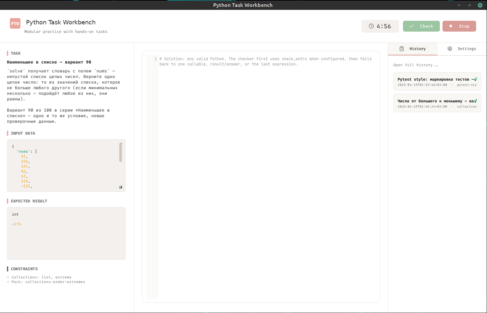</p>

### Editor and check

*Where you write `solve_task_n` and run checks.*

- `CodeEditor`: line numbers, placeholder, font from `ui_font_size`.
- **Check** runs in a **worker process**; status and mismatch text feed **Next task**, history, and the session summary.

<p align="center">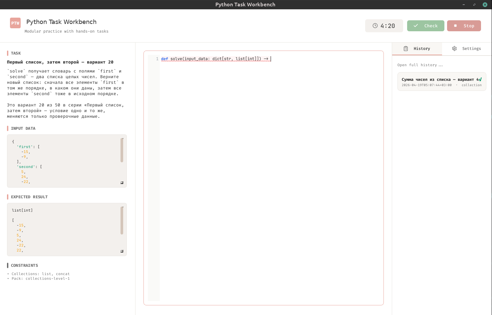</p>

### Session summary

*Results after you stop or finish the batch.*

- Chips for OK / bad / pending / checking; optional **all passed** banner; scrollable rows with status, index, title, and **report** / **code** icons when data exists (`SessionSummaryDialog`).

<p align="center">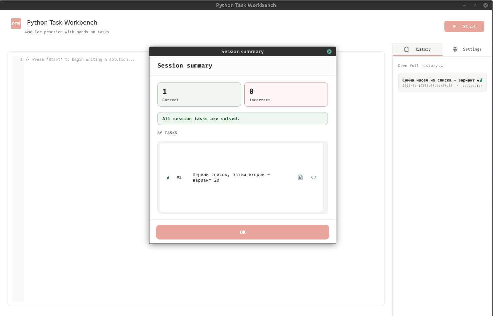</p>

### Report from summary

*Read-only checker narrative or error context.*

- Opens **`DetailTextDialog`** from a row’s report action (same pattern as history).

<p align="center">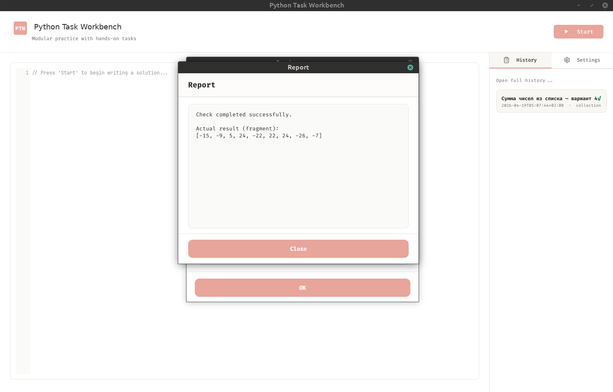</p>

### Code from summary

*Inspect submitted code with Python highlighting.*

- Long bodies may be truncated with an ellipsis (`DetailTextDialog` code mode).

<p align="center">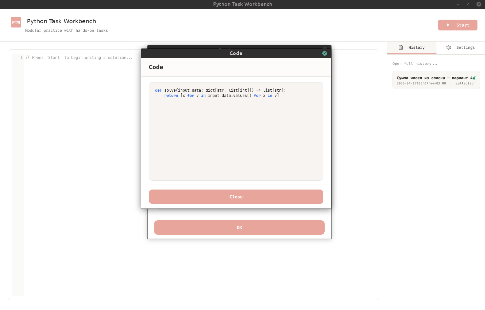</p>

### Check history

*Browse and export past runs.*

- Toolbar: **clear**, **export all**; **search** across task, pack, status, errors, results.
- Rows: **report**, **code**, **export**; backing store `load_entries_newest_first` → SQLite `history.sqlite3`.

<p align="center">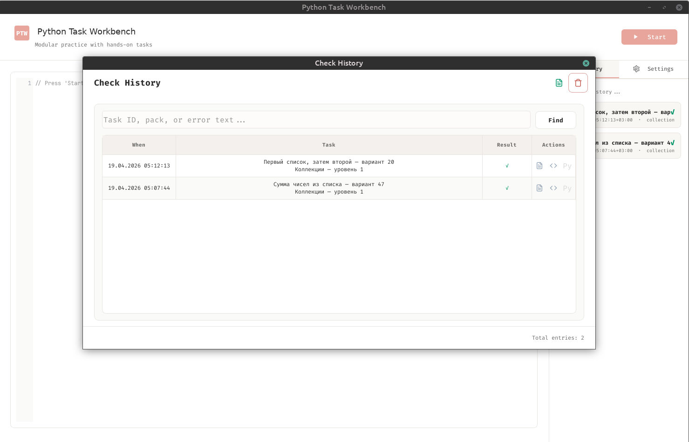</p>

### Entry details

*One run, full context.*

- Metadata (id, time, pack, status, duration), then **input**, **expected**, **actual**, **error**, **code**.
- Opened by clicking a **non-action** table cell (`HistoryDialog._on_table_cell_clicked`).

<p align="center">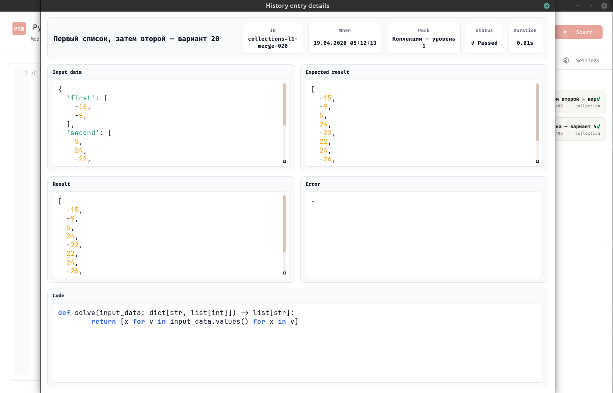</p>

### Settings

*Trainer preferences persisted with CLI defaults.*

- Collapsible groups: time budget, check timeout, autocheck on next, language, compact mode, font size, splitter weights — saved via `core.config` into `config/config.json`.

<p align="center">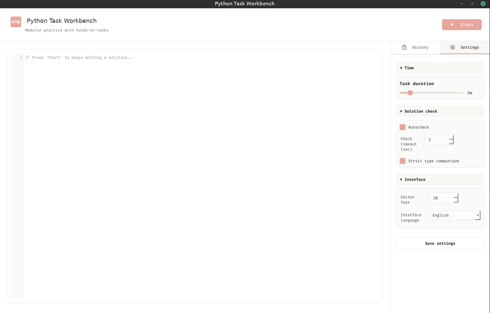</p>

---

## How it fits together

### Entry point

`app.py` (`app:main`) calls `ensure_data_directories()`, then:

| If you run | What happens |
|------------|----------------|
| `python app.py cli` | `generator.cli.entry.cli_main` → `resolve_config` → `solve` or `check` / `coach` |
| `python app.py` | `QApplication`, Fusion style + stylesheet → main window |

### Shared generator

CLI and GUI both use **`task_packs`** to discover `content_modules/` and list **variants**. The CLI builds `generator.models.Task` in batch jobs; the GUI maps parallel concepts to **`core.models.Task`** for display and checking.

### Checking

Learner code never runs on the Qt main thread: a **child process** executes the snippet, applies `checker_entry_mode`, calls `solve_task_N`, and returns structured pass/fail and hints.

### Persistence

- **GUI** — Append-only history in `data/history/history.sqlite3` (`core.check_history`), with legacy JSON migration if present.
- **CLI** — Pickle state (default under `data/history/`) plus `collections_solutions.py` (or paths from config).

### Strings

User-visible copy lives in **`messages/`** so the UI and tests stay aligned.

---

## Architecture (Mermaid)

### Entry point and CLI routing

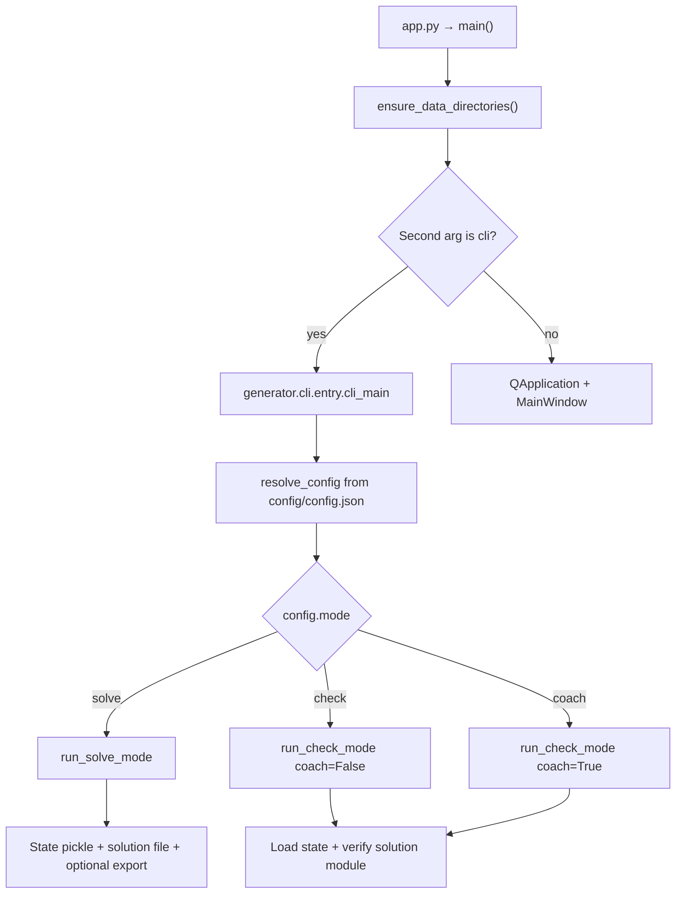

### CLI: solve vs check / coach

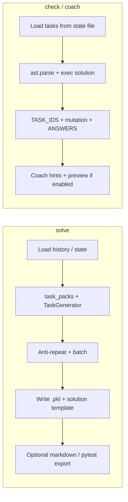

### GUI: session and checker

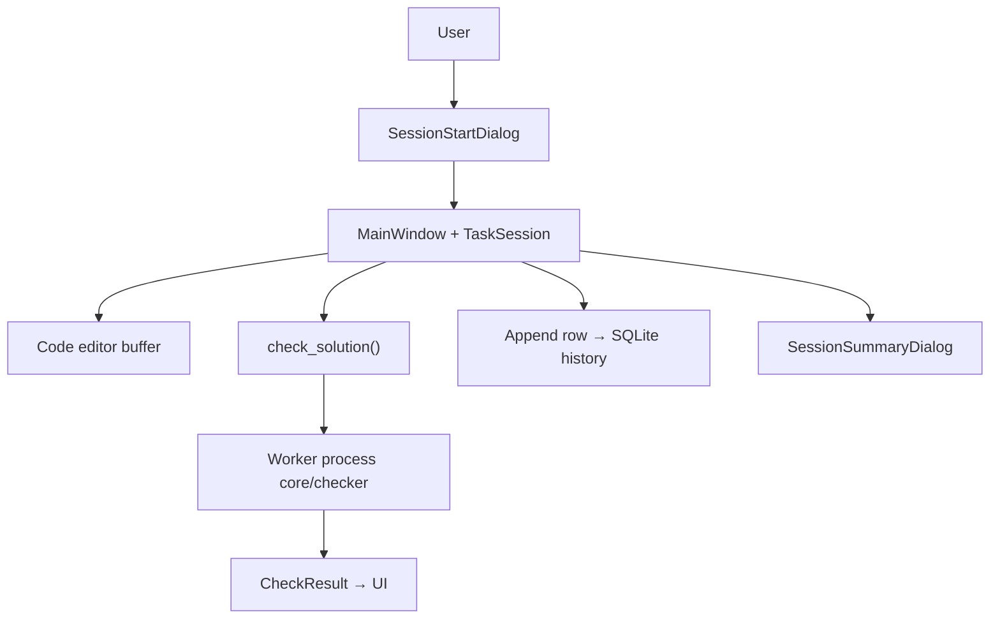

---

## System requirements

| | |
|--|--|
| **Python** | 3.12+ (`requires-python` in `pyproject.toml`) |
| **Runtime** | Faker, PyQt6 — see `requirements.txt` |
| **Dev (optional)** | pytest, ruff, black, isort — `[project.optional-dependencies].dev` |

---

## Stack

| Layer | Role |
|-------|------|
| **UI** | PyQt6 — `ui/main_window`, `ui/dialogs`, `ui/editor` |
| **Core** | Sessions, checker subprocess, config, SQLite history — `core/` |
| **Generator** | CLI modes, batch generation, exports — `generator/` |
| **Packs** | Discovery, declarative and imperative packs — `task_packs/` |

---

## Repository layout

| Path | Role |
|------|------|
| `app.py` | Entry: CLI vs GUI, styling, window placement |
| `pyproject.toml` | Package metadata; console script `python-task-workbench` → `app:main`; tool settings |
| `requirements.txt` | Pinned dependencies |
| `config/config.json` | Shared CLI defaults and GUI preferences |
| `core/` | Paths, `AppDefaults`, checker, `check_history`, session models |
| `generator/` | `AppConfig`, `resolve_config`, CLI entry and modes, task generation, exports |
| `task_packs/` | Registry, `get_variants`, declarative loading |
| `content_modules/` | Packs (`module.json` + optional code); examples: `collections-level-1`, `collections-order-extremes`, `pytest-basics-200` |
| `ui/` | Main window, dialogs, stylesheets |
| `messages/` | Shared UI/CLI strings |
| `tests/` | pytest suite |
| `data/history/` | Runtime DB, pickle state, generated solution file (often gitignored) |

---

## Configuration

All switches live in **`config/config.json`**. The CLI does not take generation flags on the command line: edit the file, then run `python app.py cli`.

### Session and generator (CLI + GUI defaults)

| Keys | Purpose |
|------|---------|
| `default_mode` | `solve` · `check` · `coach` |
| `default_count`, `default_seed`, `default_content_pack` | Batch size, seed, pack id |
| `default_topic`, `default_domain`, `default_stage` | Template filters |
| `default_data_*`, `default_profile` | Data shaping; `default_surprise_me` overrides manual picks |
| `default_story_mode`, `default_session_size`, `default_inverse_rate` | Story length and inverse rate |
| `default_show_*`, `default_hints_step`, `default_strict_types` | Printed detail and strict checks |
| `default_state_file`, `default_solution_file` | Pickle and solution module paths |
| `default_export_format`, `default_export_file` | `none`, `markdown`, `pytest`, … |
| `checker_entry_mode` | `strict` or `hybrid` |

### GUI-only

| Keys | Purpose |
|------|---------|
| `ui_window_compact`, `ui_font_size`, `ui_splitter_sizes` | Density and column weights |
| `ui_autocheck_on_next`, `ui_check_timeout_sec`, `ui_per_task_minutes` | Check automation and timer |
| `ui_language` | Interface language |
| `ui_default_packs` | Preselected packs in the new-session dialog |

Saving from **Settings** updates this file through **`core.config`**.

---

## Running the application

| Command | Result |
|---------|--------|
| `python app.py` | Start the GUI |
| `python app.py cli` | Run CLI using only `config/config.json` |
| `python-task-workbench` | Same as `python app.py` after `pip install .` |

---

## CLI modes

| Mode | Input | Behaviour |
|------|--------|-----------|
| **solve** | Config + history | Anti-repeat batch, write state pickle and `collections_solutions.py`, optional export |
| **check** | State + solution file | Validate and compare answers |
| **coach** | Same as check | Adds hints and optional input/expected preview |

For **check** and **coach**, only **`state_file`** and **`solution_file`** matter—generative fields like `count` or `topic` are ignored.

---

## GUI workflow

1. **Launch** — Create data dirs; load `AppDefaults`; show `MainWindow`.
2. **New session** — `SessionStartDialog` → `SessionConfig` → `build_session` loads variants via `task_packs.get_variants` and builds a `TaskSession`.
3. **Each task** — Sidebar shows statement, input, expected, constraints; editor holds your code. **Check** runs `check_solution` in a subprocess; results can be stored in history.
4. **Navigate** — **Next** moves through tasks; optional **autocheck on next**; header timer follows `ui_per_task_minutes`.
5. **End** — `SessionSummaryDialog` with aggregates and drill-downs.
6. **History** — Sidebar and `HistoryDialog` for search, export, clear; cell click (outside actions) opens `HistoryEntryDetailsDialog`.
7. **Settings** — `save_defaults_config` keeps CLI and UI keys in one JSON file.

---

## Content packs

Each directory under **`content_modules/`** is one pack:

| File | Role |
|------|------|
| `module.json` | Id, label, manifest metadata |
| `module.py` | Optional `get_variants` |
| `generator.py` | Optional `build_input` / `build_payload` hooks |
| Declarative JSON | Alternative specs via `task_packs/declarative_tasks.py` |

The registry also exposes a virtual **`mixed`** pack (all regular packs combined). Broken packs are reported through **`task_packs.list_discovery_issues()`**.

---

## Data and artifacts

| Artifact | Default location | Notes |
|----------|------------------|--------|
| GUI history | `data/history/history.sqlite3` | May migrate from legacy `history.json` once |
| CLI state | `data/history/.collections_tasks_state.pkl` | Needed for `check` |
| Solution template | `data/history/collections_solutions.py` | Produced by `solve` |

Override paths with `default_state_file` and `default_solution_file`.

---

## Solution file (CLI)

After **`solve`**, the generated module usually defines:

| Symbol | Role |
|--------|------|
| `TASKS` | Inputs for the batch |
| `TASK_IDS` | Must match persisted state |
| `solve_task_1` … `solve_task_N` | Functions you implement |
| `ANSWERS` | Recorded outputs for automated checking |
| `if __name__ == "__main__"` | Local debugging |

Exact layout is versioned with the generator; see **`generator/cli/solution_template.py`** and **`tests/`**.

---

## Quick start

```bash
cd python-task-workbench
python3 -m venv .venv
source .venv/bin/activate   # Windows: .venv\Scripts\activate
pip install -r requirements.txt
# pip install -e ".[dev]"    # optional dev tools
```

| Goal | Command |
|------|---------|
| Open the GUI | `python app.py` |
| Run the CLI (edit `config/config.json` first) | `python app.py cli` |
| Use the installed console script | `pip install .` then `python-task-workbench` |

---

## Tests and quality tools

```bash
pip install -e ".[dev]"
ruff check .
black . --check
isort . --check-only
pytest
```

`pyproject.toml`: line length **79**, Python **3.12**, tests under **`tests/`**.

---

## License

MIT. See `LICENSE`.
