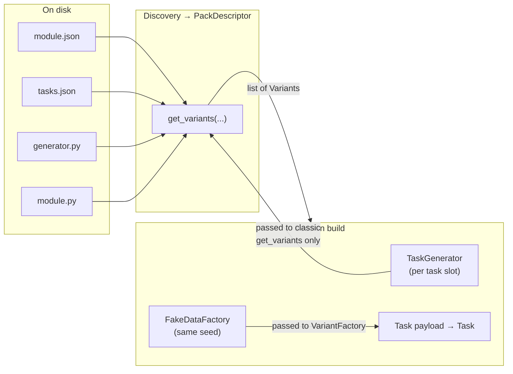
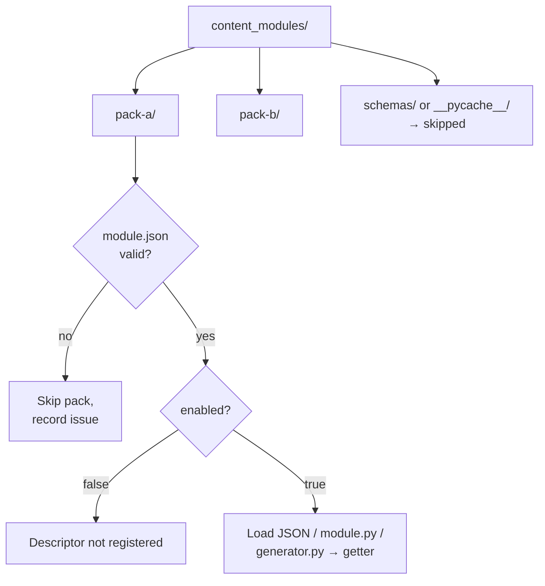
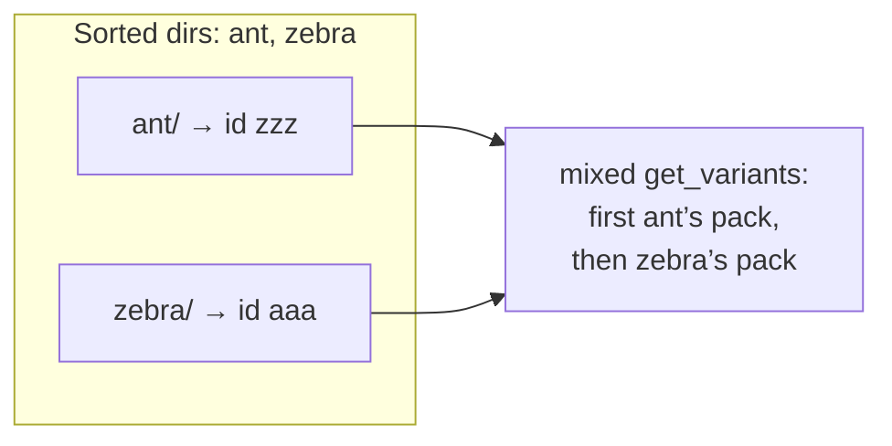
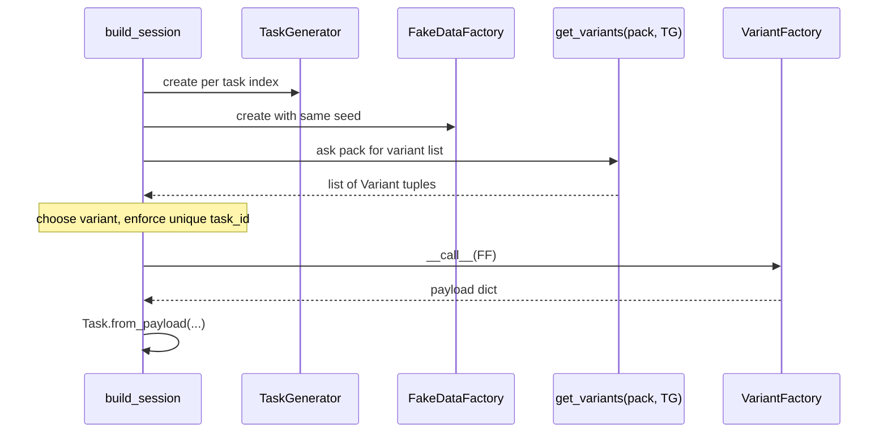
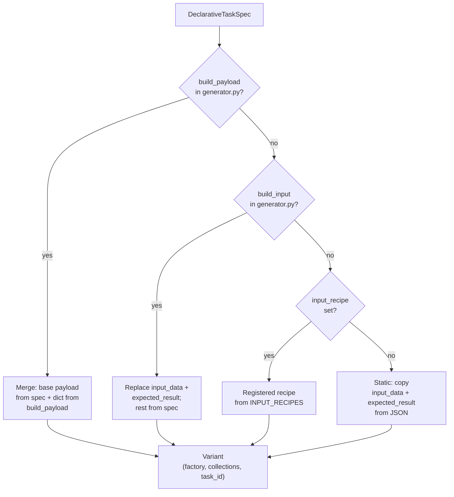

# Content modules (task packs)

**Repository note:** The root `.gitignore` tracks only `content_modules/README.md` here; pack subfolders are ignored by default (add your packs locally, or change `.gitignore` if you want to version them).

This directory is the **extension point** for training content. Each **subfolder** is one **task pack**: metadata (`module.json`), optional **declarative** task definitions (JSON), optional **Python** (`module.py` or `generator.py`), and any assets you need.

**Why this design?**

- **Separation of concerns**: Authors describe *what* a task is (title, description, checker contract) in JSON, and optionally *how* inputs are randomized in `generator.py`, without forking the main application.
- **Stable runtime contract**: Everything converges to the same internal shape—a **variant** with a **payload factory**—so the UI, checker, and session builder do not care whether a task came from JSON, recipes, or hand-written Python.
- **Safe discovery**: Broken folders are reported as **issues** and skipped; one bad pack does not stop the app.

The reference pack **`collections-level-1/`** shows manifest + `tasks.json` + `generator.py` working together.

---

## Big picture: from files to a learner session

At a high level, the pipeline has two phases:

1. **Discovery (startup / cache refresh)** — read `module.json`, load JSON rows and/or `module.py`, optionally load `generator.py`, and build a **`PackDescriptor`**: “for pack id X, here is a function that returns all **variants**.”
2. **Session build (each practice run)** — for each task slot, the core asks the selected pack(s) for variants, picks one, calls the variant’s **factory** with a **`FakeDataFactory`**, and turns the resulting **payload** into a **`Task`**.



**Important:** There are two different objects people call “generator” in code:

| Object | Role | Who receives it |
|--------|------|-----------------|
| **`TaskGenerator`** | Session-level helper (seeded per task position). | **`module.py` → `get_variants(generator)`** if that function is written with one argument. Declarative packs **ignore** this argument when listing variants. |
| **`FakeDataFactory`** | Produces randomness for **payload** fields (lists, strings, etc.). | **`VariantFactory`** in `tuple[VariantFactory, ...]` — this is what **`build_payload(factory, spec)`** and **`build_input(factory, spec)`** receive when the session builds concrete data. |

So: **`get_variants`** may see **`TaskGenerator`**; your **`build_*`** functions see **`FakeDataFactory`** (if you type-check, as in `collections-level-1/generator.py`).

---

## Discovery in detail

The registry resolves the folder:

`Path(task_packs/registry.py).parent.parent / "content_modules"`

So packs live **next to the project root that contains `task_packs`**, not inside the package tree.



For **each** subdirectory (except ignored names), the engine runs `_try_pack_descriptor` (see `task_packs/registry.py`):

1. **Manifest** — `module.json` must parse and satisfy `ModuleManifest` (id, version, `schema_version == 1`, boolean `enabled`, valid `task_files` list).
2. **`module.py`** — loaded if present (optional).
3. **`generator.py`** — loaded if present; **`build_payload`** / **`build_input`** are extracted if callable.
4. **Declarative path** — if `task_files` is non-empty and at least one row becomes a valid `DeclarativeTaskSpec`, the pack’s **`get_variants`** is implemented by turning each row into a **variant** (with factories that use your optional generators).
5. **Fallback** — if step 4 produced **no** getter (empty specs, no files, all rows invalid), the registry uses **`module.py`’s `get_variants`**.
6. If there is still no way to obtain variants, the pack is skipped and a **“no variant source”** issue is recorded.

**Why declarative first?** It keeps JSON-driven packs the default path: most authors only maintain `module.json` + JSON (+ optional `generator.py`). Classic `module.py` is the escape hatch for fully custom logic.

---

## Virtual “mixed” pack

After all regular packs load, the registry adds one **virtual** pack whose id is defined in code (`MIXED_PACK_ID_*` constants). Its **`get_variants`** concatenates every regular pack’s variants in a **fixed order**.

**Order rule:** Discovery walks **sorted** entries under `content_modules/` (by **directory name** on disk). Each successful pack is inserted into a dict keyed by manifest **`id`**. Iteration order of that dict follows **discovery order**, so the mixed pack runs packs in **lexicographic order of folder names**, not in order of manifest `id`. Example: folder `zebra/` with `"id": "aaa"` still comes **after** folder `ant/` with `"id": "zzz"` because `ant` < `zebra`.



**Why?** Lets the UI offer “all tasks at once” without duplicating definitions.

**Caching:** `discover_pack_descriptors` uses an LRU cache; `refresh_pack_descriptors()` clears it. The public `task_packs.get_variants` **refreshes** before each fetch so descriptor changes on disk are picked up during development (at the cost of re-scanning).

---

## The variant contract (core abstraction)

A **variant** is always:

```text
Variant = tuple[
    VariantFactory,   # Callable[[object], dict[str, object]]
    tuple[str, ...], # collection tags
    str,              # task_id (must be unique within a session selection pool)
]
```

- **`VariantFactory`**: Called later with one argument. In **`core/session.py`**, that argument is always **`FakeDataFactory`** (per task slot, seeded with the session).
- **Collection tags**: Used for categorization/filtering (e.g. `"list"`, `"dict"`).
- **`task_id`**: Used for **deduplication** inside a session—the same id cannot appear twice in one session.

Classic **`module.py`** returns a **list** of such tuples. Invalid list elements are **dropped** (silent coercion), so strict typing at the boundary matters.



---

## Declarative tasks (`task_files` + JSON)

### File format

- Each path in `task_files` is **relative to the pack directory**.
- Each file must be a **JSON array** of objects (one task per object).
- Invalid files/rows generate `DeclarativeTaskIssue` entries; the pack may still load if **some** rows are valid.

### Required fields (runtime validation)

The loader is stricter than the JSON schema file alone—refer to `DeclarativeTaskSpec` in `task_packs/declarative_tasks.py`.

Always required:

- `task_id`, `title`, `description` — non-empty strings.
- `collections` — non-empty array of strings (tags).
- `check_entry` — non-empty string (name exposed after user code `exec`).

**`expected_result`**: required in JSON **unless** `input_recipe` is set (recipes compute answer at runtime). If there is no recipe, missing `expected_result` makes the row **invalid**.

**`input_data`**: may be omitted or `null` → treated as `{}`.

### Checker fields

- `check_input`: omit → `"positional"`; otherwise `"positional"` or `"keyword"`.
- `check_input_kw`: required for `"keyword"`; must be absent/`null` for positional.

### `starter_code`

- Key **missing** → app default stub.
- Value **`null`** → empty editor.
- **String** → initial buffer.

Schema reference: `config/content_task.schema.json` (informative; runtime rules above win).

---

## How one JSON row becomes one variant (strategy chain)

For each validated `DeclarativeTaskSpec`, the engine picks **exactly one** strategy. Order is fixed (`_variant_from_spec` in `task_packs/declarative_tasks.py`):



**Why `build_payload` wins over `build_input`:** One hook must own “full override” semantics; otherwise two competing partial updates would be ambiguous. If you define **`build_payload`**, **`build_input` is not used** for building variants.

**Why `build_payload` disables recipe behavior for that pack:** When a payload generator is present, **every** row in that pack goes through the merge path; `input_recipe` is only consulted in the branch where **neither** pack-level generator exists.

---

## Pack `generator.py` (randomized data + contract overrides)

### Loading

The file must live in the pack folder next to `module.json`. Import failures return **`None`** as the generator module—callbacks are then missing, and the pack falls back to pure JSON/recipes.

### `build_payload(factory, spec) -> dict[str, object]` (preferred)

**What the engine does:**

1. Builds a **baseline** payload dict from the declarative row (`_task_payload_dict`): titles, descriptions, tags, checker defaults from JSON, etc.
2. Calls **`build_payload(factory, spec)`**.
3. **Normalizes** your return value to a string-keyed dict.
4. **`payload.update(deepcopy(your_dict))`** — so your keys **override** the baseline. Keys you omit stay as in JSON.

**Why merge instead of replace?** You can override only `input_data` and `expected_result` while leaving long `description` / metadata in JSON untouched.

### `build_input(factory, spec) -> (dict, object)` (legacy-style)

**What the engine does:**

1. Builds baseline from spec.
2. Replaces **`input_data`** and **`expected_result`** with your tuple’s values.
3. Leaves other keys from JSON unless you switch to **`build_payload`**.

### Contract rules

- Return dicts must use **only string keys** (normalized in the engine).
- `build_input` must return a **2-tuple** `(dict, anything)` or the adapter raises.

### Typing hints

```python
from task_packs.declarative_tasks import DeclarativeTaskSpec
from generator.fake_data import FakeDataFactory
```

Use **`spec.task_id`** to dispatch (see `collections-level-1/generator.py`).

---

## Classic `module.py` (full custom variants)

Use when you do **not** rely on declarative JSON (or JSON failed to load and you still provide code).

Export:

```python
def get_variants() -> list[Variant]: ...
# or
def get_variants(generator: object) -> list[Variant]: ...
```

The registry tries **zero arguments first**; on **`TypeError`**, it retries with **`TaskGenerator`**. If your function **requires** an argument but none is passed from a code path that does not supply `TaskGenerator`, you get a pack-specific error.

Returned list items must be valid **variant** triples; malformed entries are skipped.

---

## Folder layout (checklist)

```text
content_modules/
  your_pack/
    module.json          # required
    tasks.json           # optional: declarative rows
    generator.py         # optional: build_payload / build_input
    module.py            # optional: get_variants if declarative path empty
```

---

## Troubleshooting

| Symptom | Likely cause |
|--------|----------------|
| Pack missing in UI | Invalid `module.json`, wrong `schema_version`, or `enabled: false`. |
| Pack missing entirely | No variant source after load (no valid JSON rows and no `module.py` getter). |
| Fewer tasks than rows | Invalid rows skipped; **`input_recipe`** unknown id skipped when no payload generator; duplicate **`task_id`** across variants can reduce effective pool. |
| Generator seems ignored | **`build_payload` present** → **`build_input` unused**; import error in `generator.py`; wrong function names (`build_payload` / `build_input` exact). |
| Randomness “wrong” | Per session **position**, `FakeDataFactory` is re-seeded; expect different numbers per slot unless you fix the session seed and understand the selection index. |

---

## Where to read the implementation

| Topic | File |
|-------|------|
| Scan order, manifests, `module.py` / `generator.py` | `task_packs/registry.py` |
| JSON row validation, merge rules, strategy chain | `task_packs/declarative_tasks.py` |
| `Variant` type aliases | `task_packs/pack_types.py` |
| Session: seeds, `get_variants`, `VariantFactory(FakeDataFactory)` | `core/session.py` |
| Public API `get_variants`, cache refresh | `task_packs/__init__.py` |
